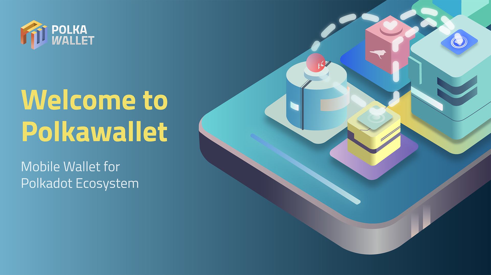

# Polkawallet App

## Download
[](https://apps.apple.com/us/app/polkawallet/id1520301768)
[](https://play.google.com/store/apps/details?id=io.polkawallet.www.polka_wallet)

----

[](https://github.com/polkawallet-io/app/releases)
[](https://github.com/polkawallet-io/app/tags)

Polkawallet built with Flutter, https://polkawallet.io



## Introduction

[Polkawallet](http://polkawallet.io) provide one-stop management for cross-chain assets, convenient staking and governance operations, and the private key is self-owned.

Polkawallet is aiming to provide a more convenient entrance of the polkadot network for all the users of Polkadot/Kusama/Substrate-based-blockchains.

- Friendly UI.
- Secure local accounts storage.
- Intuitive Tokens management.
- Simplified staking & governance operations.
- Offline signature supported.
- Available for both IOS and Android.
- Support any Substrate-based-blockchain to integrate as plugins.

### Todos
- [ ] Add proxy account operations.
- [ ] Support walletConnect protocol.

## Getting Started

Dependencies
 - Flutter 2.5.x statble
 - Dart 2.10.x

To get started
 1. Clone the repo locally, via git clone https://github.com/polkawallet-io/app.git `<optional local path>`.
 2. Install the dependencies by running `flutter pub get`.
 3. In AndroidStudio, run `lib/main.dart` with arguments `--flavor=prod` on Android Devices,
 or just run `lib/main.dart` with no arguments on IOS.

## Contribute

This app was built with several repos, developers of other substrate based chain
may create their own plugin and put it into polkawallet app:

```
__ polkawallet-io/app
    |
    |__ polkawallet-io/ui
    |    |__ polkawallet-io/sdk
    |
    |__ polkawallet_plugin_kusama
    |    |__ polkawallet-io/sdk
    |    |__ polkawallet-io/ui
    |
    |__ polkawallet_plugin_acala
    |    |__ polkawallet-io/sdk
    |    |__ polkawallet-io/ui
    |
    |__ polkawallet_plugin_laminar
    |    |__ polkawallet-io/sdk
    |    |__ polkawallet-io/ui
    |
    |__ <plugin of another substrate based chain>
    |__ <...>
```

### 1. polkawallet-io/js_api
This is a `polkadot-js/api` wrapper which will be built into a single `main.js` file
to run in a hidden webView inside the App. So the App will connect to a substrate node
with `polkadot-js`.

And we wrapped `polkadot-js/keyring` in it, so the App can manage keyPairs.

### 2. polkawallet-io/sdk
This is a `polkawallet-io/js_api` wrapper dart package, it contains:

 1. Keyring. Managing keyPairs.
 2. PolkawalletSDK. Connect to remote node and call `polkadot-js/api` methods.
 3. PolkawalletPlugin. A base plugin class, defined the data and life-circle methods
 which will be used in the App.

A polkawallet plugin can get users' keyPairs in the App from Keyring instance.

A polkawallet plugin implementation should extend the `PolkawalletPlugin` class and
define it's own data & life-circle methods.

### 3. polkawallet-io/ui
The common used flutter widgets for `polkawallet-io/app`, like:
 - AddressInputForm
 - TxConfirmPage
 - ScanPage
 - ...

### 4. polkawallet-io/polkawallet_plugin_xxx
Examples:
 1. [polkawallet-io/polkawallet_plugin_kusama](https://github.com/polkawallet-io/polkawallet_plugin_kusama)
 2. [polkawallet-io/polkawallet_plugin_acala](https://github.com/polkawallet-io/polkawallet_plugin_acala)
 3. [polkawallet-io/polkawallet_plugin_laminar](https://github.com/polkawallet-io/polkawallet_plugin_laminar)

### 5. App state management
We use [https://pub.dev/packages/mobx](https://pub.dev/packages/mobx).
so the directories in a plugin looks like this:
```
__ lib
    |__ pages (the UI)
    |__ store (the MobX store)
    |__ service (the Actions fired by UI to mutate the store)
    |__ ...
```

### 6. Submit your plugin
While your plugin was finished and tested, you may submit an issue in this repo.
We will check into your plugin and add it into the App.

### 7. Plugin update
Submit a update request issue to update your plugin. There are two different kinds of update:
 1. Update the dart package. We will rebuild the App and publish a new release.
 2. Update the js code of your plugin (dart code was not affected). We will rebuild the
  js bundle file and the app will perform a hot-update through polkawallet-api.


### Translation
Polkawallet App has several translation projects on [crowdin.com](https://crowdin.com/):

 - [polkawallet](https://crowdin.com/project/polkawallet)
 - [kusama plugin](https://crowdin.com/project/polkawalletpluginkusama)
 - [acala plugin](https://crowdin.com/project/polkawalletpluginacala)

Language files in the project are written in `json-like` style:
```dart
final enAccount = {
    'key': 'value',
    'key.another': 'Another value for translation.',
    'key.multiline': 'Multiline text are \n split with symbol \n.',
};

/// This 3 strings above will display in the App like:
// value

// Another value for translation.

// Multiline text are
// split with symbol
// .
```
You need to keep the `'key'` field on the left as it is, and translate the `'value'`
field on the right only. Note that the `\n` symbol split a long string into several lines.

### Release checklist

 - [ ] sdk version code updated.
 - [ ] sdk jsCodeVersion code updated.
 - [ ] sdk version code of `polkawallet-io/ui` updated.
 - [ ] sdk & ui dependencies of plugins updated.
 - [ ] plugins version updated.
 - [ ] plugins node list updated.
 - [ ] version code in `pubspec.yaml` updated.
 - [ ] version code in Xcode for IOS updated.